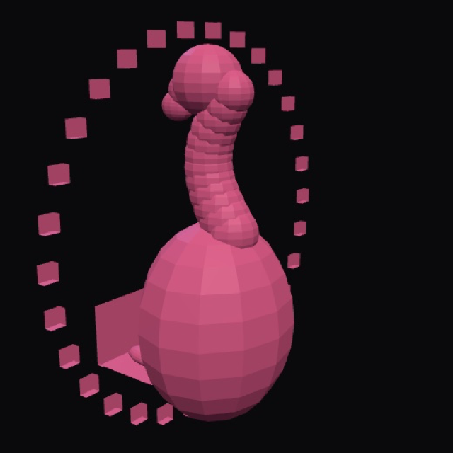

# 03 — flamingo_3d.obj

가벼운 **OBJ 메시** 단계. 본(리그) 없이 입체 실루엣만 보는 중간 슬롯.



> 레포 슬롯: **3/6** · 표현 단위 = **메시 회전** (트래킹 없음)

## 모션 데모


턴테이블 회전으로 “입체인가?”만 확인. 휴머노이드 본·표정 없음.

## 모델

| 항목 | 내용 |
|------|------|
| 모델 | `models/flamingo_3d.obj` (+ `flamingo_3d.mtl`) |
| 미리보기 | `preview.png` / `preview-readme.png` |
| 트래킹 | 없음 (뷰어 회전만) |
| 다음 단계 | 04 Meshy 텍스처 메시 → 05 리깅 VRM → 06 풀 트래킹 앱 |

## 뷰어

```bash
# 레포 루트에서
python3 -m http.server 8799
# http://127.0.0.1:8799/demos/view3d/  → 패널 C (OBJ)
# 단일 캡처: /demos/view3d/capture.html?m=obj
```

또는 아무 OBJ 뷰어로 `models/flamingo_3d.obj` 열기.
