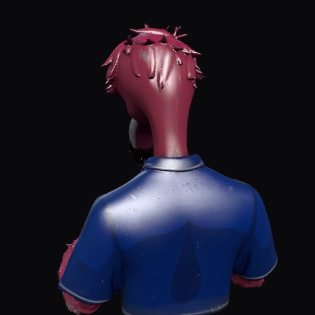

# 04 — Meshy 3D FBX

**Meshy** 로 뽑은 블루 저지 플라밍고 **생성 3D 메시**.  
그림(01/02) 다음, 본 트래킹(05/06) 전에 두는 “입체 외형” 슬롯.



> 레포 슬롯: **4/6** · 표현 단위 = **텍스처 메시 회전**

## 모션 데모


생성 3D 외형·텍스처 확인용 턴테이블. 버튜버용 휴머노이드 본은 약함.

## 모델

| 항목 | 내용 |
|------|------|
| 모델 | `models/meshy_flamingo.fbx` (~31MB) |
| 텍스처 | `models/meshy_flamingo.png` |
| 미리보기 | `preview.png` / `preview-readme.png` |
| 트래킹 | 없음 (뷰어 회전만) |

## 뷰어

```bash
# 레포 루트에서
python3 -m http.server 8799
# http://127.0.0.1:8799/demos/view3d/  → 패널 B (Meshy)
# 단일 캡처: /demos/view3d/capture.html?m=fbx
```

## 비고

03 OBJ보다 디테일·텍스처는 풍부하고,  
05/06 VRM 리타게팅 전 **형태 확인용**으로 쓴다.
