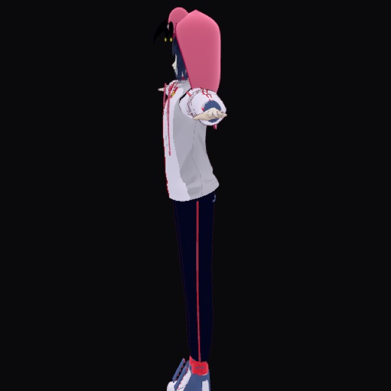

# 05 — flamingo_motion.vrm (리깅 VRM)

**스켈레톤이 있는 VRM** 단계.  
휴머노이드 본 + 플라밍고 후드 룩 — 트래킹 앱(06) 직전 모델 슬롯.



> 레포 슬롯: **5/6** · 표현 단위 = **스켈레톤(본)**  
> 폴더 구 이름: `05-mingo-vtuber2-vrm` → **`05-flamingo-motion-vrm`**

## 모션 데모


턴테이블 + 가벼운 고개 모션. 이 레포 안에서는 **모델·비교용** (풀 트래킹 셸은 형제 앱/06).

## 모델

| 항목 | 내용 |
|------|------|
| 모델 | `models/flamingo_motion.vrm` |
| 미리보기 | `preview.png` / `preview-readme.png` |
| 형제 풀 앱 | [mingo-vtuber2](https://github.com/minwoo19930301/mingo-vtuber2) (Swift/Metal + Vision) |
| 이 슬롯 | 모델 스냅샷 + 웹 뷰어 비교 |
| 다음 | **06** Electron + MediaPipe 풀 스택 |

## 뷰어

```bash
# 레포 루트에서
python3 -m http.server 8799
# http://127.0.0.1:8799/demos/view3d/  → 패널 D (VRM)
# 단일 캡처: /demos/view3d/capture.html?m=vrm
```

네이티브 앱:

```bash
cd ../../mingo-vtuber2
# README의 swift test / FlamingoStudio 실행
```

## 06과의 차이

| | 05 | 06 |
|--|----|----|
| 모델 | `flamingo_motion.vrm` | VRoid 계열 avatar + 커스텀 룩 |
| 셸 | Swift/Metal (형제 레포) | Electron + three-vrm |
| 이 모노레포 역할 | 모델·비교 슬롯 | 실행 가능한 풀 트래킹 앱 |
