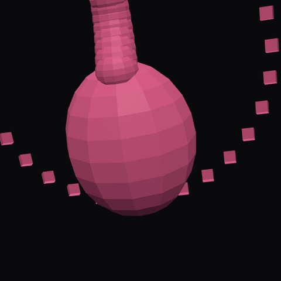
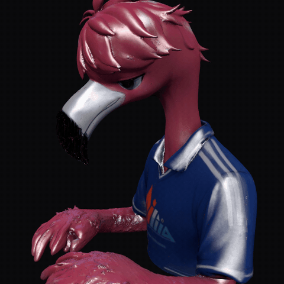
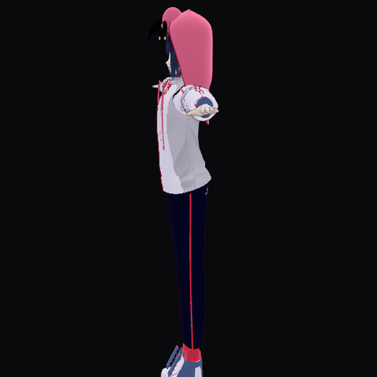
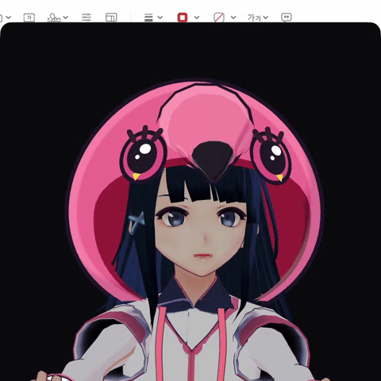
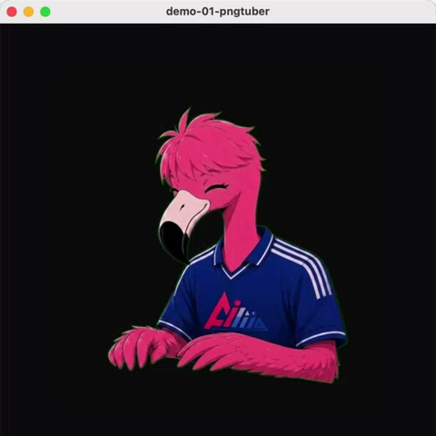
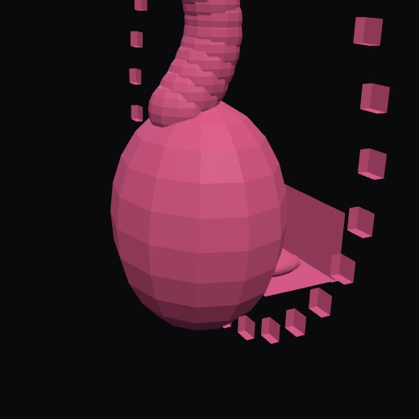
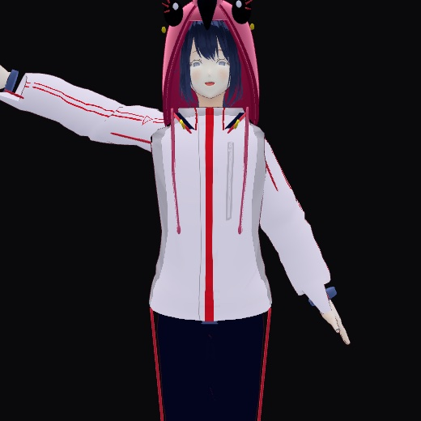
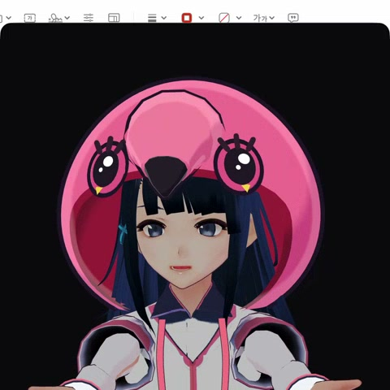

# vtuber-lab

`flam-ing` 버튜버 실험 모노레포.  
같은 캐릭터 IP(밍고/플라밍고)를 **표현 복잡도**를 올려 가며 쌓은 실험실이다.

활성 슬롯은 **번호 폴더** (01 → 06).

| # | 폴더 | 한 줄 | 움직이는 단위 | 상태 |
|---|------|------|---------------|------|
| **1** | **[01-mingo-4cut/](01-mingo-4cut/)** | 4컷 PNG — 입·눈 스위치 | **장면(이미지 전체)** | ✅ |
| **2** | **mingo-vtuber Chibi** (형제 레포) | **라우디 러프 보이즈** 풍 + 플라밍고 후드 레이어 리그 | **파츠(머리·팔·손·입·눈)** | ✅ |
| **3** | **[03-flamingo-3d-obj/](03-flamingo-3d-obj/)** | `flamingo_3d.obj` 가벼운 메시 | 메시 회전 | ✅ |
| **4** | **[04-meshy-flamingo-fbx/](04-meshy-flamingo-fbx/)** | **Meshy** 생성 3D FBX | 메시 회전 | ✅ |
| **5** | **[05-flamingo-motion-vrm/](05-flamingo-motion-vrm/)** | `flamingo_motion.vrm` 리깅 VRM | **스켈레톤(본)** | ✅ |
| **6** | **[06-vroid-base-custom-girl/](06-vroid-base-custom-girl/)** | Electron + MediaPipe **풀 트래킹 앱** (구 슬롯 04) | **본 + 실시간 트래킹** | ✅ |
| — | **[archive/](archive/)** | live2d · flamingo2 · 실험 잔여 | — | 보관 |

> 예전 **슬롯 04 (vroid Electron 앱)** → 지금 **슬롯 06**.  
> 03~05는 그 앞에 **입체·리그 중간 단계**를 append 한 것.  
> 슬롯 05 폴더명: `05-flamingo-motion-vrm` (구 `05-mingo-vtuber2-vrm`).

---

## 미리보기 (모션 데모 · 6개 전부)

검은 배경 · 얼굴/웹캠 UI 없음 · 아바타만 움직이도록 녹화한 데모 GIF.  
(06 데모 촬영은 **상반신 프레이밍** — 모델 자체는 전신 유지)

| 01 · 4컷 PNGTuber | 02 · 라우디 러프 + 후드 | 03 · flamingo_3d.obj |
|:--:|:--:|:--:|
|  |  |  |
| 입 · 깜빡 · 흔들림 | 고개 · 입 · 윙크 · 손 포즈 | bob · rock · 짧은 yaw (본 없음) |

| 04 · Meshy FBX | 05 · flamingo_motion.vrm | 06 · VRM 풀 앱 |
|:--:|:--:|:--:|
|  |  |  |
| bob · rock · 짧은 yaw | 고개·깜빡·입·팔 포즈 페이즈 | 고개/표정 · 팔·손 포즈 사이클 |

> 데모는 **설명용 스크립트 모션** (얼굴이 영상에 안 나오게).  
> 실제 앱(01/02/06)은 웹캠 Face/Pose 트래킹. 소스·캡처: [`demos/`](demos/)

### 정지 컷 (각 슬롯 폴더 `preview*`)

| 01 | 02 | 03 |
|:--:|:--:|:--:|
|  |  |  |

| 04 | 05 | 06 |
|:--:|:--:|:--:|
|  |  |  |

### 03~05 로컬 통합 뷰어

드래그 회전 / 스크롤 줌 4분할:

```bash
# 레포 루트에서
python3 -m http.server 8799
# http://127.0.0.1:8799/demos/view3d/
```

| 패널 | 슬롯 | 에셋 |
|------|------|------|
| A | (참고) Live2D 미리보기 | `archive/live2d` |
| B | **04** Meshy FBX | `04-meshy-flamingo-fbx/models/` |
| C | **03** OBJ | `03-flamingo-3d-obj/models/` |
| D | **05** flamingo_motion.vrm | `05-flamingo-motion-vrm/models/` |

---

## 왜 이렇게 나눴나?

```
① 센싱   카메라 → 숫자
② 매핑   숫자 → 캐릭터 상태
③ 표현   캐릭터를 화면에 그림
```

| 슬롯 | 표현 | 한 줄 |
|------|------|------|
| 01 | 2D 스프라이트 스위치 | 가장 싼 입·눈 |
| 02 | 2D 레이어 리그 (후드) | 고개·팔·손 파츠 |
| 03 | 본 없는 OBJ | “입체인가?” 확인 |
| 04 | 생성 FBX + 텍스처 | 디테일 있는 메시 |
| 05 | 리깅 VRM 모델 | 스켈레톤 있는 휴머노이드 |
| 06 | VRM + 트래킹 앱 | **최종 제품형** |

---

## 1) mingo 4cut — 가벼운 PNGTuber

```bash
cd 01-mingo-4cut
../tuber-env/bin/python run_pngtuber.py
```

→ [01-mingo-4cut/README.md](01-mingo-4cut/README.md)

---

## 2) 라우디 러프 보이즈 스타일 2.5D — 플라밍고 후드

**런타임:** [`mingo-vtuber` / `apps/chibi`](https://github.com/minwoo19930301/mingo-vtuber)

```bash
cd ../mingo-vtuber
npm install && npm run chibi:dev
```

폴더 `02-chibi-25d/` 는 후드 없는 Anime2.5D **실험 잔여** (혼동 주의).

---

## 3) flamingo_3d.obj

가벼운 로우폴리 메시. 본 없음 — 입체 실루엣 확인용.

→ [03-flamingo-3d-obj/README.md](03-flamingo-3d-obj/README.md)

---

## 4) Meshy 3D FBX

생성 3D 플라밍고 (블루 저지). FBX ~31MB.

→ [04-meshy-flamingo-fbx/README.md](04-meshy-flamingo-fbx/README.md)

---

## 5) flamingo_motion.vrm — 리깅 VRM

스켈레톤이 있는 휴머노이드 VRM.  
형제 앱: [mingo-vtuber2](https://github.com/minwoo19930301/mingo-vtuber2) (Swift/Metal).

→ [05-flamingo-motion-vrm/README.md](05-flamingo-motion-vrm/README.md)

---

## 6) vroid-base-custom-girl — 풀 트래킹 앱 (최종)

```bash
cd 06-vroid-base-custom-girl
npm install
npm run dev
```

→ [06-vroid-base-custom-girl/README.md](06-vroid-base-custom-girl/README.md)

---

## 환경

### Python (01)

```bash
uv venv --python 3.12 tuber-env
uv pip install --python ./tuber-env/bin/python -r requirements.txt
```

### Node (02 형제 레포 · 06)

```bash
cd 06-vroid-base-custom-girl && npm install
```

---

## 레이아웃

```
vtuber-lab/
├── 01-mingo-4cut/              # 4컷 PNGTuber
├── 02-chibi-25d/               # (실험) 후드 없는 Anime2.5D — 대표는 mingo-vtuber
├── 03-flamingo-3d-obj/         # OBJ 메시
├── 04-meshy-flamingo-fbx/      # Meshy FBX
├── 05-flamingo-motion-vrm/     # flamingo_motion.vrm (리깅)
├── 06-vroid-base-custom-girl/  # Electron 풀 앱 (구 04)
├── demos/                      # README GIF 01–06 + view3d 뷰어
├── archive/
└── README.md
```
