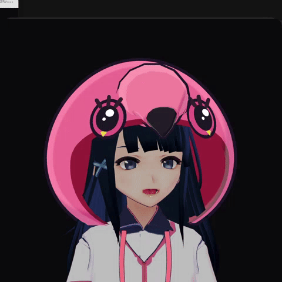
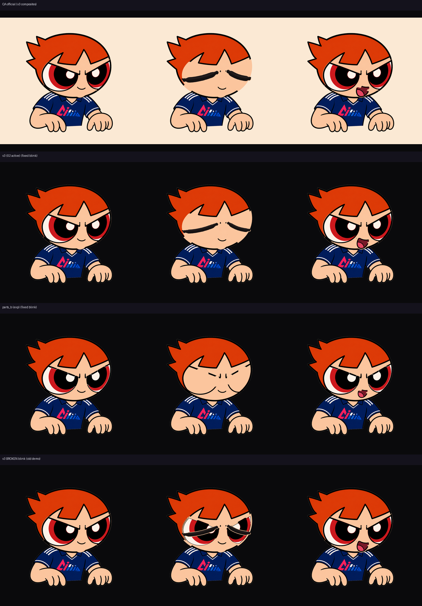

# vtuber-lab

`flam-ing` 버튜버 실험 모노레포.  
같은 캐릭터 IP(밍고/플라밍고)를 **표현 복잡도 3단계**로 올려 가며 만든 실험실이다.

활성 작업은 **번호 폴더**에 둔다.

| # | 폴더 | 한 줄 | 움직이는 단위 | 상태 |
|---|------|------|---------------|------|
| **1** | **[01-mingo-4cut/](01-mingo-4cut/)** | 4컷 PNG — 입·눈 스위치 | **장면(이미지 전체)** | ✅ |
| **2** | **[02-chibi-25d/](02-chibi-25d/)** | 치비 2.5D — 파츠 레이어 | **파츠(눈·입·손…)** | ✅ |
| **3** | **[03/](03/)** | (예정) | — | 🔒 |
| **4** | **[04-vroid-base-custom-girl/](04-vroid-base-custom-girl/)** | VRM 3D 전신 | **본(관절)** | ✅ |
| — | **[archive/](archive/)** | live2d · flamingo2 · 실험 잔여 | — | 보관 |

---

## 미리보기 (모션 데모)

검은 배경 · 얼굴/웹캠 UI 없음 · 아바타만 움직이도록 녹화한 데모 GIF.  
(04는 **데모 촬영만** 상반신 프레이밍 — 모델 자체는 전신 유지)

| 01 · 4컷 PNGTuber | 02 · 치비 2.5D | 04 · VRM 3D |
|:--:|:--:|:--:|
|  |  |  |
| 입 · 깜빡 · 흔들림 (순수 흑배경) | 고개 기울기 · 시선 · 손 포즈 · 입/깜빡 | 상반신 구도 · 고개/표정 · 부드러운 팔 |

> 데모는 **설명용 스크립트 모션**이다 (얼굴이 영상에 안 나오게).  
> 실제 앱은 웹캠 Face/Pose 트래킹으로 구동한다. 소스: [`demos/`](demos/)

---

## 왜 세 개인가?

버튜버 파이프라인은 공통으로 3층이다.

```
① 센싱   카메라 → 숫자 (입 열림, 눈 감김, 고개 각도…)
② 매핑   숫자 → 캐릭터 상태
③ 표현   캐릭터를 화면에 그림
```

세 버전은 **③ 표현 방식**만 다르게 쌓은 것이다.

| | 01 4컷 | 02 2.5D | 04 3D VRM |
|--|--------|---------|-----------|
| 개념 | PNGTuber / 스프라이트 스위치 | 레이어드 2.5D 리그 | 휴머노이드 리타게팅 |
| 아트 | 통짜 PNG 4장 | 파츠로 잘라 PSD 조립 | VRM 모델 + 외형 커스텀 |
| 트래킹 | 얼굴 (입·눈) | 얼굴·고개·시선·손 파츠 | 얼굴 + 손 + **전신 포즈** |
| 직접 한 일 | 4컷 아트, 임계값 매핑 | 자르기·PSD 파이프 | 룩/후드/앱 UX/트래킹 배선 |
| 빌린 것 | MediaPipe Face | Anime2.5DRig 런타임 | VRM·three-vrm·MediaPipe Pose 등 |

**한 문장 요약**

> 그림 4장 스위치 → 파츠 레이어 2.5D → 3D 골격 리타게팅.  
> 4번은 3D 엔진을 처음부터 짠 게 아니라, **검증된 VRM 휴머노이드 스택을 커스터마이즈**해 완성도를 올린 버전이다.

---

## 1) mingo 4cut — 가벼운 PNGTuber

**원리:** idle / talk / blink / talk+blink **4장 중 하나를 고르고** 크로스페이드.  
뼈 없음 · 만들기 쉬움 · “입 뻐끔” 단계.

```bash
cd 01-mingo-4cut
../tuber-env/bin/python run_pngtuber.py
```

→ [01-mingo-4cut/README.md](01-mingo-4cut/README.md)

---

## 2) chibi-style 2.5 VTuber

**원리:** 눈흰자·홍채·입·손 등을 **파츠 PNG로 분리** → PSD 레이어 →  
[Anime2.5DRig](https://852wa.github.io/Anime2.5DRig/) 에 드롭해 고개/시선/입을 움직인다.

```bash
cd 02-chibi-25d
../tuber-env/bin/python assemble_chibi.py
# Chrome: https://852wa.github.io/Anime2.5DRig/ 에 chibi_anime25d.psd 드롭
```

→ [02-chibi-25d/README.md](02-chibi-25d/README.md)

### 2.5 버전 여러 개 (로컬에 남아 있음)

| 버전 | 위치 | 비고 |
|------|------|------|
| **v3 활성** | `02-chibi-25d/` | `chibi_anime25d.psd` + `parts/` (현재 슬롯) |
| **실험 b** | `archive/chibi_experiments/parts_b/` | 파츠 세트 B · `preview_b.png` |
| **실험 PSD** | `archive/chibi_experiments/chibi_anime25d_*.psd` | 복사본 / b / v3 |
| **QA 합성** | `archive/chibi_experiments/parts/qa_*.png` | idle·blink·talk **정답 합성** |
| **flamingo2** | `archive/flamingo2/` | 다른 치비/생성 파이프 |

버전 비교 시트:   
(`demos/chibi_versions_compare.png`)

**깜빡임 합성 주의:** open-eye 레이어(`eyewhite`·`irides`·`eyelash`)를 켠 채로  
`eye_close`만 올리면 **뜨지도 감지도 않은 눈**처럼 보인다.  
깜빡일 때는 open-eye를 **전부 끄고** closed lid만 켠다. (데모: `demos/demo_02_clean.py`)

---

## 4) vroid-base-custom-girl — 3D 전신 VTuber

**원리:** VRM 휴머노이드 본에 MediaPipe Face/Hand/**Pose** 를 리타게팅.  
Electron 투명 패널 + three.js + `@pixiv/three-vrm`.  
(구 `mingo-mate` 계열을 이 슬롯으로 이관)

```bash
cd 04-vroid-base-custom-girl
npm install
npm run dev
```

클린 모션 데모(카메라 UI 없음):

```bash
MINGO_DEMO_MOTION=1 npm run dev
```

→ [04-vroid-base-custom-girl/README.md](04-vroid-base-custom-girl/README.md)

---

## 환경

### Python (01 / 02)

```bash
# repo 루트
uv venv --python 3.12 tuber-env
uv pip install --python ./tuber-env/bin/python -r requirements.txt
```

시스템 `/usr/bin/python3` 로 4컷 GUI 돌리지 말 것 (Tk 8.5 흰 화면).

### Node (04)

```bash
cd 04-vroid-base-custom-girl && npm install
```

---

## 레이아웃

```
vtuber-lab/
├── 01-mingo-4cut/                 # 4컷 PNGTuber
├── 02-chibi-25d/                  # 치비 Anime2.5D
├── 03/                            # reserved
├── 04-vroid-base-custom-girl/     # VRoid/VRM Electron 3D
├── demos/                         # README용 모션 GIF
├── archive/
├── requirements.txt
├── tuber-env/                     # local only (gitignore)
└── README.md
```

---

## 데모 다시 만들기

```bash
# 01/04: 검은 배경 + 아바타 창 녹화 → GIF (demos/ 스크립트)
# 02: 파츠 합성 오프라인 애니 GIF
ls demos/*.gif
```

녹화 헬퍼: `demos/black_backdrop.py`, `demos/demo_01_clean.py`, `demos/demo_02_clean.py`,  
`demos/record_clean.sh` (참고용 · 창 좌표/권한 환경에 민감)
